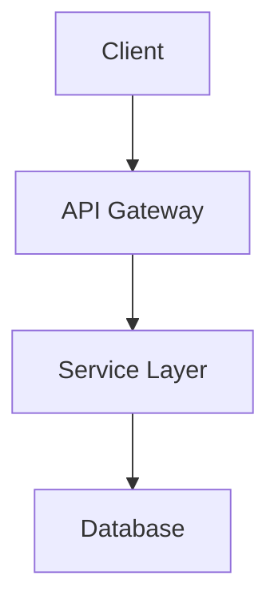

# Documentation Generator — Workflow

## When to use

- **New team member joining** -- Generate an onboarding guide so they can ramp up fast
- **After a major feature or refactor** -- Update architecture docs to reflect current state
- **API consumers need reference** -- Generate endpoint documentation from code
- **Project has no documentation** -- Bootstrap docs/ from scratch
- **Never** for trivial updates (single function change, typo fix)

## Process

### Step 1: Detect documentation mode

Ask the user which documentation to generate:

1. **Architecture** -- System overview, components, data flow, patterns, Mermaid diagrams
2. **API** -- REST/GraphQL endpoints with methods, parameters, responses, examples
3. **Onboarding** -- Developer setup guide, conventions, workflow, codebase tour
4. **All** -- Generate all three (architecture first, then API, then onboarding)

### Step 2: Scan the codebase

Based on the selected mode, scan relevant files:

**Architecture mode:**
- Project structure (directories, key files)
- Entry points (main, index, app files)
- Configuration files (package.json, docker-compose, CI config)
- Module boundaries and imports graph
- Design patterns in use (MVC, hexagonal, event-driven, etc.)

**API mode:**
- Route definitions (Express routes, FastAPI endpoints, controller files)
- Request/response schemas (DTOs, types, validation)
- Middleware chain (auth, validation, error handling)
- OpenAPI/Swagger specs if present

**Onboarding mode:**
- README.md (existing setup instructions)
- CLAUDE.md (conventions and workflow)
- Package manager and dependency files
- Test commands and CI configuration
- Environment variables (.env.example)

### Step 3: Generate documentation

Write markdown files to `docs/` directory:

#### Architecture output: `docs/architecture.md`

```markdown
# Architecture — [Project Name]

## Overview
[1-2 paragraph summary of what the system does and how it's structured]

## System Diagram



## Components

### [Component Name]
- **Purpose:** [what it does]
- **Location:** `path/to/module/`
- **Key files:** `file1.ts`, `file2.ts`
- **Dependencies:** [what it imports]
- **Dependents:** [what imports it]

## Data Flow
[Describe how data moves through the system]

## Design Patterns
- **[Pattern name]:** [where and why it's used]

## Key Decisions
- [Decision 1 and rationale]
```

#### API output: `docs/api.md`

```markdown
# API Reference — [Project Name]

## Base URL
`{{BASE_URL}}`

## Authentication
[Auth method and usage]

## Endpoints

### [Resource Name]

#### `GET /api/resource`
**Description:** [what it does]

**Parameters:**
| Name | Type | Required | Description |
| --- | --- | --- | --- |
| limit | number | No | Max results (default: 20) |

**Response (200):**
```json
{
  "data": [],
  "total": 0
}
```

**Errors:**
| Code | Description |
| --- | --- |
| 401 | Unauthorized |
| 404 | Resource not found |
```

#### Onboarding output: `docs/onboarding.md`

```markdown
# Developer Onboarding — [Project Name]

## Prerequisites
- [Runtime version]
- [Package manager]
- [Required tools]

## Setup

### 1. Clone and install
```bash
git clone [repo-url]
cd [project]
[install command]
```

### 2. Environment configuration
```bash
cp .env.example .env
# Fill in: [list of required variables]
```

### 3. Run the project
```bash
[start command]
```

### 4. Run tests
```bash
[test command]
```

## Project Structure
```
project/
├── src/          → [description]
├── tests/        → [description]
└── docs/         → [description]
```

## Conventions
- [Coding convention 1]
- [Commit format]
- [Testing approach]

## Common Tasks
- **Add a new feature:** [workflow]
- **Fix a bug:** [workflow]
- **Deploy:** [workflow]

## Architecture Overview
See [architecture.md](architecture.md) for the full system design.
```

### Step 4: Review with user

After generating docs:
- Present a summary of what was generated
- Ask the user to review for accuracy
- Iterate on any corrections or additions
- Suggest committing with `/commit`

## After generation

- **Commit the docs** with `/commit` when the user approves
- **Keep docs updated** -- re-run after major changes
- **Link from README** -- add links to generated docs in the project README

## Common Pitfalls

- **Generating docs nobody reads:** Keep docs short and scannable. If a section needs more than 2 scrolls, split it.
- **Documenting implementation details:** Focus on "what" and "why", not "how" at the line level. Code is the source of truth for implementation.
- **Stale docs:** Generated docs drift from code. Re-run periodically or after major changes.
- **Missing the audience:** Onboarding is for new devs, architecture is for the team, API is for consumers. Don't mix audiences.
- **Over-diagramming:** One clear diagram beats five complex ones. Use Mermaid for the main system view, not every function call.

## References

### External Frameworks
- Daniele Procida, *Diataxis Documentation Framework* (2017) -- tutorials, how-to, reference, explanation
- Simon Brown, *C4 Model for Software Architecture* (2006) -- context, container, component, code diagrams
- Tom Preston-Werner, *Readme Driven Development* (2010)

### Related Skills
- `/review` -- May flag missing documentation as a suggestion
- `/tech-debt-audit` -- Includes documentation gaps in its assessment

### Credit
- Inspired by Desktop Commander "Create Project Documentation" and "Generate Dev Onboarding Guide" prompt patterns.
